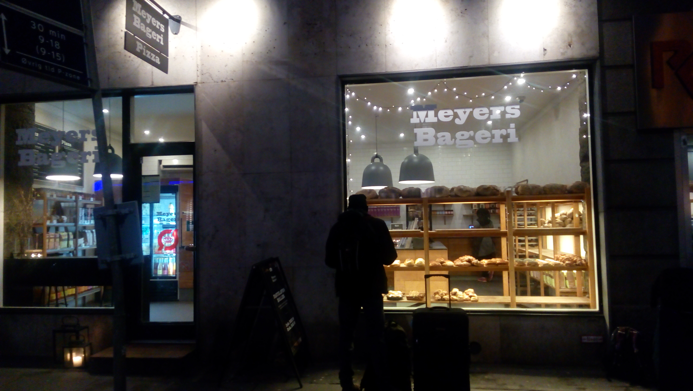
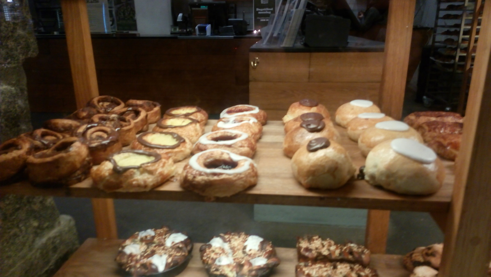
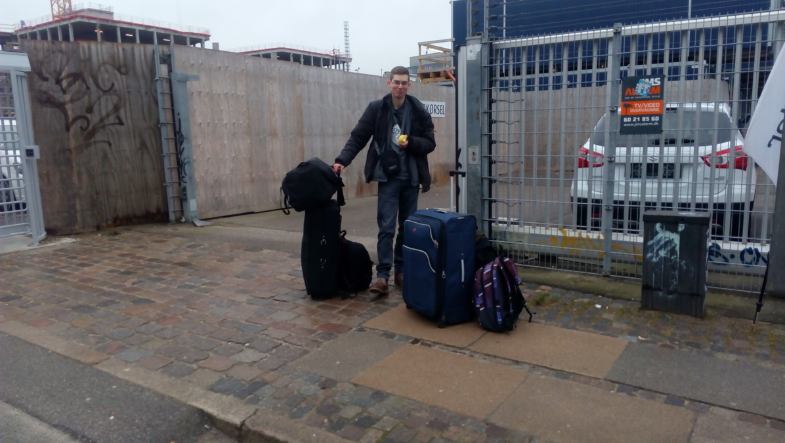

"Budete psát blog, <b>jako všichni Erasmáci na FI?</b>"
Tuto sugestivní otázku jsme zaslechli tolikrát, že se zdá, že
pokud jste student FI vyjídějící na Erasmus a rozhodnete se nepsat blog,
stanete se sociálním vyvrhelem, který bude navždy žít na pokraji společnosti a žrát suchý chleba.
*Myslíte* si ale, že my bychom tomuto sociálně-politickému tlaku podlehli?

Ano, podlehli.
Když už jsme byli tímto drsným způsobem donuceni psát blog,
udělali jsme *si* nejprve průzkum možností pro psaní blogu (prosté HTML, redakční systém jako třeba WordPress, webové služby jako třeba Blogger). S některými z nich jsme se nemohli ztotožnit
a nakonec jsme se rozhodli použít generátor statických stránek,
což je taková bezva věc, díky které můžete psát články ve `vimu` a publikovat je pomocí příkazu `git push`.

Když jsme rozhodli, *že* pojedeme na Erasmus...
- proc do Danska: legoland (+ predmety)

- je
- byrokacie: prihlaksa s motivacnim dopisem + vyber skol, test z anglictiny na fakulte, learning agreement (musi podepsat postupne uplne vsichni a nelze otevrit ve Wordu), ubytovani, ucastnicka smlouva na CZS, zaridit dopravu a pojisteni.

- tohle
- ubytovani: drahy (nejlevnejsi koleje: 2600++), chteli jsme mit spolecny dvojluzkovy pokoj, coz nevyslo, bezvadny system: povinny stostrankovy manual, “list of typical payment errors” je dobry mit vzdy po ruce

- jediny
- doprava obecne
*jediný* zajímavý moment ... trajekt

- *clanek*
Hned po vystoupení z autobusu nás málem sráží cyklista, takže víme, že jsme opravdu v Dánsku.
Nejprve si musíme vyzvednout klíče v kanceláři Housing Foundation, protože bez nich se na koleje nedostaneme.
Je teprve 6:30 a kancelář otevířá až v 9:30, takže moc nespěcháme a zvažujeme, že bychom se po cestě někde nasnídali.
Jirka jako první cíl pobytu v Dánsku vytyčuje najít obchod s koblihami, což se nám podařilo nečekaně brzo.

Ze zastávky autobusu jdeme nejprve chvíli rovně a na první křižovatce zahýbáme doprava.
Pak jdeme docela dlouho podél trati.
Za hřbitovem, *který* je obehnán zdí, procházíme dvakrát hned za sebou pod železničním mostem a ocitáme se na hlavní ulici s plno obchody, kapličkou a školou.
Mezi železářstvím a květinářstvím si všimneme pekárny a náš cíl je tedy na dosah. Vstupujeme dovnitř a hned vpravo za dveřmi vidíme, co hledáme!

Dánové vynalezli nový typ koblih, náplň není uvnitř koblihy, ale venku. Stojí ale 20 DKK, což se nám zdá docela hodně, tak se na ni jenom 5 minut zálibně díváme a pak pokračujeme *v* cestě.
Za chvíli už dorážíme ke kanceláři Housing Foundation, která ještě neměla otevřeno, což jsme využili k snídani, projití tří lekcí dáštiny, vypočítání několika integrálů a běhu kolem budovy.
Vydání klíčů proběhlo bez problémů, až na to, že Jirkovi zapomněli dát klíč od poštovní schránky.
Pak už to bylo jenom horší. S přibývajícími hodinami nám ubývalo nejen sil, ale zejména koleček na našich kufrech.
Každých 20 metrů jsme se museli zastavit, protože jsme si potřebovali odpočinout, ale předstírali jsme, že se učíme dáštinu překládáním dánských nápisů.

- *sobe*
- bude/je
- vyzvy

- *skryva*
- vyzvy

- sifra
Přemýšleli jsme, jak zpestřit články v tomto blogu,
napadly nás třeba videoreportáže, Věřte nevěřte, detektivka.
Nebo by se nám dokonce mohlo podařit do blogu ukrýt *šifru?*.

- Tak vyražte.
