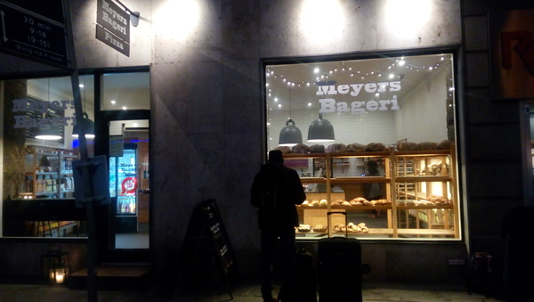
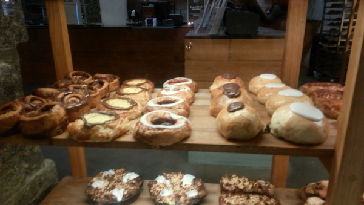
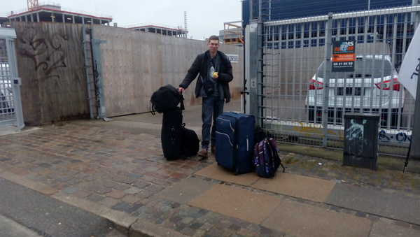

"Budete psát blog, <b>jako všichni Erasmáci na FI?</b>"
Tuto sugestivní otázku jsme zaslechli tolikrát, že se zdá, že
pokud jste student FI vyjíždějící na Erasmus a rozhodnete se nepsat blog,
stanete se sociálním vyvrhelem, který bude navždy žít na pokraji společnosti a žrát suchý chleba.
*Myslíte* si ale, že my bychom tomuto sociálně-politickému tlaku podlehli?

Ano, podlehli.
Když už jsme byli tímto drsným způsobem donuceni psát blog,
udělali jsme *si* nejprve průzkum možností pro psaní blogu (prosté HTML, redakční systém jako třeba WordPress, webové služby jako třeba Blogger). S&nbsp;některými z&nbsp;nich jsme se nemohli ztotožnit
a nakonec jsme se rozhodli použít generátor statických stránek,
což je taková bezva věc, díky které můžete psát články ve `vimu` a publikovat je pomocí příkazu `git push`.

Proč vyjíždíme studovat do zahraničí, místo toho abychom radši zůstali doma ve sklepě bez jakýchkoli sociálních interakcí jako správní ajťáci?
Chceme totiž vyrůst. Jakože osobnostně. Doma je to moc jednoduchý, zato v&nbsp;zahraničí nás nepochybně čeká spousta <s>problémů</s> výzev, jejichž vyřešením získáme kýbl životních zkušeností.
Kromě toho nám přišlo fajn, *že* poznáme cizí kulturu, zlepšíme se v&nbsp;angličtině a podobný věci, který se píšou do přihlášky na Erasmus.
Dánsko jsme si vybrali hlavně kvůli zajímavým předmětům a Legolandu.

Erasmus *je* fajn v&nbsp;tom, že s&nbsp;ním není potřeba řešit tolik byrokracie, jako u&nbsp;jiných programů pro studium v&nbsp;zahraničí.
V&nbsp;podstatě stačilo podat přihlášku s&nbsp;motivačním dopisem a seznamem tří preferovaných univerzit,
absolvovat zkoušku z&nbsp;angličtiny, počkat na nominaci od fakulty, sepsat learning agreement a nechat ho podepsat fakultním koordinátorem a referentkou v&nbsp;Centru zahraniční spolupráce, vyplnit a odeslat přihlášku na Kodaňskou univerzitu, odeslat learning agreement pro podpis do Kodaně,
zajistit si ubytování, pojištění a dopravu do Kodaně, směnit si pár dánských korun, podepsat účastnickou smlouvu v&nbsp;Centru zahraniční spolupráce, vyplnit údaje o&nbsp;zahraničním studiu v&nbsp;ISu. A&nbsp;můžete vyrazit!

Největší srandu jsme si užili při shánění ubytování, které má v&nbsp;Kodani pod palcem Housing Foundation, díky které jsme měli už před odjezdem příležitost poznat dánský smysl pro humor.
Před výběrem ubytování, který probíhá klikací soutěží, nám zaslali k&nbsp;nastudování stostránkový manuál a poměrně dlouhý seznam poplatků, který obsahuje například poplatek za pozdní platby, poplatek za platby převodem z&nbsp;účtu a poplatek za platby kartou.
Vždy když vstupujete do jejich systému, jste zařazeni do virtuální fronty, ve které musíte aspoň minutu čekat, i pokud před váma nikdo není.
Systém neponechává nic náhodě a zajišťuje, aby ve sdílených pokojích byli lidé stejného pohlaví.
Pokud chce pár bydlet společně, musí provést následující manévr (podrobně popsaný v&nbsp;devatenácté kapitole manuálu): jeden z&nbsp;partnerů si v&nbsp;systému dočasně změní pohlaví, což umožní zapsat se do stejného pokoje a poté si musí vrátit pohlaví zpět. Manuál na závěr ujišťuje, že *tohle* je jediná příležitost, kdy po vás budou chtít, abyste jim lhali.
Housing Foundation nabízí hrnec různých ubytování, ale po vyfiltrování těch, které by nás dovedli k&nbsp;vyhlášení osobního bankrotu, nám zbyla jediná možnost: dvojlůžkové pokoje na kolejích Tåsingegade.
Chtěli jsme bydlet ve společném pokoji, což teda nevyšlo, ale aspoň máme pokoje na stejném patře.
Pak už zbývalo jenom ubytování zaplatit, což je docela hračka, pokud máte po ruce "List of typical payment errors".

Do Kodaně se dá dostat několika způsoby, ale některé z&nbsp;nich jsou moc drahé pokud cestujete s&nbsp;velkými zavazadly (letadlo), některé jsou pořád moc drahé a pomalejší (vlak) a některé jsou levné, ale ještě pomalejší (koloběžka).
Takže jsme zvolili autobus, který nám přišel jako rozumný kompromis mezi koloběžkou a letadlem.
Do Kodaně jezdí přímo z&nbsp;Brna několik autobusových dopravců, všichni nabízí podobné ceny, ale jen *jediný* z&nbsp;nich tam jel v&nbsp;den, kdy se nám to hodilo.

Takže sedíme v&nbsp;autobusu do Kodaně a píšeme tento *článek*.
Jediným zpestřením je plavba trajektem mezi Německem a Dánskem.
Hned po vystoupení z&nbsp;autobusu nás málem sráží cyklista, takže víme, že jsme opravdu v&nbsp;Dánsku.
Je teprve 6:30, ale nastěhovat se můžeme až od 12:00, a proto moc nespěcháme a zvažujeme, že bychom se po cestě někde nasnídali.
Jirka jako první cíl pobytu v&nbsp;Dánsku vytyčuje najít obchod s&nbsp;koblihami, což se nám podařilo nečekaně brzo.

Ze zastávky autobusu jdeme nejprve chvíli rovně a na první křižovatce zahýbáme doprava.
Pak jdeme docela dlouho podél trati.
Za hřbitovem, *který* je obehnán zdí, procházíme dvakrát hned za sebou pod železničním mostem a ocitáme se na hlavní ulici s&nbsp;plno obchody, kapličkou a školou.
Mezi železářstvím a květinářstvím si všimneme pekárny a náš cíl je tedy na dosah. Vstupujeme dovnitř a hned vpravo za dveřmi vidíme, co hledáme!

Dánské koblihy se od těch českých liší ve dvou důležitých aspektech.
Za prvé, náplň není uvnitř, ale venku.
Za druhé, stojí dvacet dánských korun. A to se nám zdá docela hodně, tak se na ni jenom pět minut zálibně díváme a pak pokračujeme __*v*__ cestě.
S&nbsp;přibývajícími hodinami nám ubývá nejen sil, ale zejména koleček na našich kufrech.
Každých dvacet metrů se musíme zastavit, protože si potřebujeme odpočinout, ale předstíráme, že se učíme dánštinu překládáním nápisů na budovách.
Začínáme litovat všech těch frisbee, papírových kapesníků, poznámkových bloků a patnácti litrů piva.
Po čtyřech hodinách zápasení s&nbsp;fyzikálními zákony o&nbsp;pohybu kufrů, promočení, vyčerpaní, zdevastovaní a na absolutním dně svých sil se konečně ocitáme na ulici, na jejímž konci je naše kolej.
O&nbsp;hodinu později dorážíme do našeho nového domova.

Jo a ještě jedna věc.
Abychom zajistili, že pobyt v&nbsp;Dánsku neproflákáme studiem, vytyčili jsme si sami *sobě* cíle, které chceme splnit.
Můžete se na ně podívat, protože jsou zapsané ve formě [issues na GitHubu](https://github.com/effa/erasmus/issues).
Tam taky bude k&nbsp;vidění průběh plnění včetně fotodůkazů.

Nejsme žádní zbabělci, takže nám klidně můžete vymyslet další výzvy. V&nbsp;nejhorším je zbaběle odmítneme.
Nejjednodušší způsob je založit novou issue na GitHubu, nebo napište váš námět do diskuze, která se *skrývá* pod tímto článkem.

Jo a ještě druhá věc. (Už fakt končíme..) Přemýšleli jsme, jak zpestřit články v&nbsp;tomto blogu,
napadly nás třeba videoreportáže, Věřte nevěřte, detektivka.
Nebo by se nám dokonce mohlo podařit do blogu ukrýt *šifru?*
